# TokenMaster

<p align="center">
  
</p>

**A new cost model for code-understanding agents.** TokenMaster re-engineers *token economics at the harness layer* — the layer that decides what the model re-reads on every single turn — for [Claude Code](https://docs.claude.com/en/docs/claude-code) and GitHub Copilot CLI.

The thesis in one line: **the model should pay once to understand a codebase's structure, then never again.** Today's harnesses violate this on every turn — they hand the model a growing transcript and let it grep its way to understanding, re-paying for the entire accumulated context turn after turn. TokenMaster makes that re-derivation *economically illegal*: structural questions get routed to a **prebuilt code graph** answered in one bounded query, so the cumulative token bill collapses instead of compounding.

### Baseline vs TokenMaster, measured

Same CLI. Same model. Same task. The only variable is whether TokenMaster's routing agent is on.

> **-73% input tokens. 3.71x more efficient overall. Up to 7.8x on blast-radius analysis.**
> **12 / 12 tasks answered from the graph. Zero correctness regressions.**
> >
> *Pooled across scikit-learn + sympy. 36 live GitHub Copilot runs.* [*Full breakdown below.*](#by-the-numbers)

```javascript
/token-master
```

That one command builds the index for the current repository and turns on routing.

---

## Why token economics, not token *count*

A token is not a billing line — it is **work the model is forced to do.** Every token in the context window is re-read, re-attended, and re-reasoned-over on *each* turn. So the cost that matters is not *tokens sent once* but the **integral of context size over the whole task** — every turn's working set, summed until done.

This reframing changes what counts as a win:

- A naive harness "saves" nothing by being short-per-turn if it takes 40 turns of grep to trace a call graph — each turn re-processes a larger and larger working set, and the integral explodes.
- A graph-routed harness answers the same question in a handful of bounded queries with a small, *stable* working set — so the integral collapses, even when any single turn looks comparable.

TokenMaster is the harness layer that enforces this discipline: it **routes the model away from re-derivation and toward pre-computed structure**, and makes the efficient path the *default* one rather than merely offering it.

## By the numbers

First proven on **Django** (992 `.py` files, hard multi-hop tasks), then **replicated on independent SWE-bench Lite repos** to rule out single-repo luck. One measurement throughout: cumulative input tokens to finish a structural task, **the baseline agent vs the same setup with TokenMaster on**.

> **Baseline** = the stock agent, no routing layer. It answers structural questions by reading and re-reading files, turn after turn. **TokenMaster** routes those same questions to a prebuilt graph. Identical model (`claude-sonnet-4.5`), identical prompts, identical correctness oracle. The routing agent is the only thing that changes.

### Pooled headline

*36 live GitHub Copilot runs. 2 repos x 3 tasks x 2 reps x 3 arms.*

|  | Baseline | **TokenMaster** | Delta |
| --- | :---: | :---: | :---: |
| Cumulative input tokens | baseline | **-73.1%** | **3.71x fewer** |
| Tasks answered from the graph | n/a | **12 / 12** | never fell back |
| Correctness vs AST oracle | pass | **pass** | no regression |

### Where the win lives

The harder the traversal, the bigger the collapse. Caller lookups save 3-5x; blast-radius analysis ("what breaks if I change this?") is where the baseline agent detonates, re-reading files across the whole repo to trace impact, and where one bounded graph query wins biggest:

```javascript
Cumulative input tokens to finish the task   (lower is better)

"Who calls X?"  -  reverse dependency lookup
  scikit-learn  Baseline    █████████                      69,609
  scikit-learn  TokenMaster ███                            21,215   3.3x fewer
  sympy         Baseline    ██████████████                107,954
  sympy         TokenMaster ███                            21,189   5.1x fewer

"What breaks if I change this?"  -  blast radius
  scikit-learn  Baseline    ███████████████████████████   203,481
  scikit-learn  TokenMaster ████                           26,908   7.6x fewer
  sympy         Baseline    ████████████████████████████  210,214
  sympy         TokenMaster ████                           26,830   7.8x fewer
```

On blast radius, the baseline balloons past **200,000 tokens** tracing impact by hand; TokenMaster answers from the graph in **\~27,000** - an order-of-magnitude saving, repeated across two unrelated codebases.

### Honest negatives — the proof the method is real

A harness that wins *everywhere* is measuring an artifact. TokenMaster doesn't:

- **Inheritor lookup on sympy ran -44%** - the graph query cost more than the baseline on that one task. Reported, not hidden.
- **Negative control** (a question the baseline already nails in \~3 turns) correctly came out a **wash** - no traversal needed, no win claimed.

> **Provenance.** Every figure above comes from the project's live A/B/C benchmark harness
> (`run_nav.py` -> `score_nav.py`), reproduced verbatim from its generated report. The benchmark
> sandbox and raw reports are kept out of this repo by design (research and scratch stay on disk).
> Django origin figures: **-72% overall (3.5x), up to -80% (5.0x)**.

## How it works

TokenMaster installs a **routing agent** that prefers graph queries over grep, backed by two interchangeable graph suppliers and the host CLI's own session memory:

| Layer | Supplier | Role |
| --- | --- | --- |
| **Semantic-spatial** (default) | [`graphify`](https://github.com/safishamsi/graphify) | Fast, no-LLM structural index. Answers callers / callees / impact / inheritors from inferred edges. The cheap default. |
| **Precise-spatial** (last-mile) | [`@colbymchenry/codegraph`](https://www.npmjs.com/package/@colbymchenry/codegraph) | AST-resolved call edges. The precision escalation: when an inferred edge isn't trustworthy enough — precision-critical impact analysis, or sparse call graphs (common in JS/TS) where name-inference under-connects. Costs more tokens to buy exact edges. |
| **Temporal** | host CLI session memory | Native cross-session recall — no extra server. |

The routing layer is the product; the indexes are interchangeable suppliers. Routing is the load-bearing primitive — in early tests the model queried the graph **0/15 times** without an explicit nudge and **8/8** with it. A graph the model never queries saves nothing, so TokenMaster's job is not to *offer* the efficient tool but to make it the path of least resistance.

## Installation

TokenMaster supports two host CLIs — **Claude Code** and **GitHub Copilot CLI**. Install the
routing agent for whichever you use (the prerequisites below are shared). `/token-master` builds
the per-repo graph and installs the host-appropriate routing agent into your user-scope CLI home.

### Claude Code

TokenMaster is distributed as a Claude Code plugin through a plugin marketplace:

```javascript
/plugin marketplace add shyamsridhar123/TokenMasterX
/plugin install token-master@token-master
```

Then, inside any repository you want to index:

```javascript
/token-master
```

The installer writes the routing agent to `~/.claude/agents/token-master.md` and registers the
graph MCP server in `~/.claude.json`. After the first install, **restart Claude Code** (or start it
with `claude --agent token-master`) for routing to take effect.

### GitHub Copilot CLI

Copilot CLI reads the **same plugin marketplace** as Claude Code, so installation is the same two
commands. In an interactive `copilot` session:

```javascript
/plugin marketplace add shyamsridhar123/TokenMasterX
/plugin install token-master@token-master
```

(Equivalently, from your shell: `copilot plugin marketplace add shyamsridhar123/TokenMasterX`
followed by `copilot plugin install token-master@token-master`.)

Then, inside any repository you want to index:

```javascript
/token-master
```

This builds the per-repo graph and writes the routing agent — with its MCP servers declared inline —
to `~/.copilot/agents/token-master.agent.md`. After the first install, **restart Copilot** (or start
it with `copilot --agent token-master`) for routing to take effect.

> **If you have *both* Claude Code and Copilot CLI installed**, the `/token-master` installer can't
> tell which CLI launched it and defaults to Claude Code. Force the Copilot target by setting
> `TOKEN_MASTER_HOST=copilot` in your environment before running `/token-master`. As a manual
> alternative you can run the installer directly and pass the host explicitly:
> >
> \`\`\`
> python token-master-plugin/skills/token-master/setup.py <repo-root> --host=copilot
> \`\`\`

### Prerequisites

- [**`graphify`**](https://github.com/safishamsi/graphify) — the default graph backend. Install with [`uv`](https://docs.astral.sh/uv/):

```javascript
  uv tool install graphify
```

- **`uv`** — the routing agent launches the graph server through it.
- **`node` + `npm`** *(optional)* — only needed for the precise `codegraph` escalation backend. Without them, TokenMaster runs graphify-only and still works.

If a prerequisite is missing, `/token-master` tells you exactly what to install, then re-run it.

## Usage

After setup, just ask structural questions normally:

- *"Who calls `force_str`?"*
- *"What breaks if I change the signature of this method?"*
- *"What inherits from `BaseValidator`?"*

The agent answers them from the graph. To confirm routing is active, ask a known structural question and check that the answer comes from a graph tool call rather than a grep sweep.

Re-run `/token-master` whenever the code has changed enough that the graph is stale.

> **Note:** The routing agent loads at CLI startup. After the first install, restart your host CLI
> (or start it with `--agent token-master`) for routing to take effect. The setup summary prints the
> exact restart command for your host.

## What gets written

`/token-master` is conservative about your working tree:

- The code graph is stored at `.token-master/graph.json` inside the repo.
- `.token-master/` and `.codegraph/` are added to the repo's `.gitignore`.
- The routing agent and graph server are installed to your user-scope CLI home, not the repo.

## Honest limitations

- **Not a universal speedup.** TokenMaster wins on hard, multi-hop traversal. On short structural questions that grep answers in \~3 turns, it is correctly *neutral*. A harness that "wins everywhere" is measuring an artifact.
- **graphify edges are inferred; codegraph is the last mile.** The default backend infers call edges by name (\~0.8 confidence) — fast and cheap, and on well-named Python it answers correctly the large majority of the time. `codegraph` exists to buy the *last mile* of precision: AST-resolved edges for the cases inference can't be trusted on. That precision is not free. On the SWE-bench Lite pilot, codegraph cost **\~3-4x more tokens than graphify** and on the simpler caller/inheritor tasks frequently ran *below* the baseline; its resolved edge set **diverged from graphify's inferred set on every compared cell** — different, and exact, but not a free upgrade. The takeaway the data supports: **graphify is the default; codegraph is the deliberate escalation when an exact edge is worth paying for**, not an always-on replacement.
- **Sparse call graphs.** On some languages (notably JavaScript/TypeScript) graphify's call graph is sparse; setup detects this and prints a warning pointing you at the `codegraph` backend.
- **Cumulative tokens, not dollars.** TokenMaster optimizes the integral of context size over a task. Billing proxies (premium requests, total token counts) are explicitly *not* the metric.

## Repository layout

```text
token-master-plugin/          The plugin (this is the deliverable)
├── .claude-plugin/
│   └── plugin.json            Plugin manifest
└── skills/token-master/
    ├── SKILL.md               The /token-master command
    ├── setup.py               Installer: builds the graph, installs the host agent
    ├── graphify_mcp.py        Graph-query MCP server
    ├── agent.template.claude.md    Routing agent template (Claude Code format)
    └── agent.template.copilot.md   Routing agent template (Copilot CLI format)

.claude-plugin/
└── marketplace.json           Plugin marketplace manifest (the packager)

assets/
├── generate_art.py            Deterministic, dependency-free SVG generator
└── tokenmaster-hero.svg       The hero image above (reproducible from a seed)
```

The hero image is generative: it *is* the thesis. The faint tangle is grep
sprawl — context re-read turn after turn — and the single bright path is one
bounded graph-routed query. Regenerate or remix it with:

```bash
python assets/generate_art.py --seed 42
```

## License

[MIT](LICENSE)